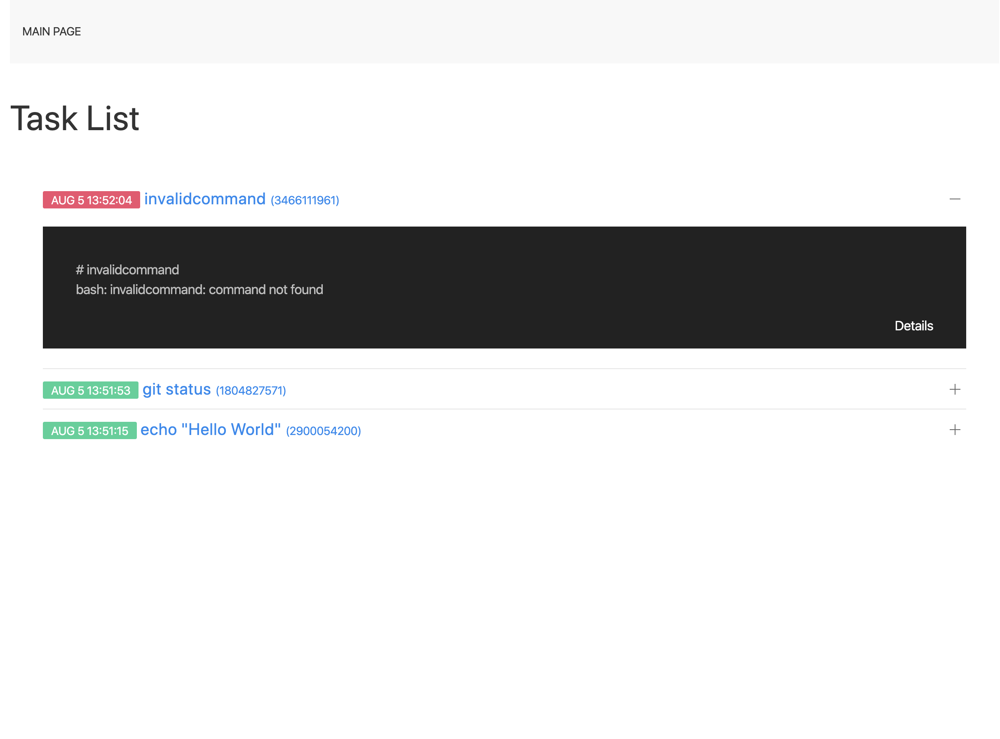
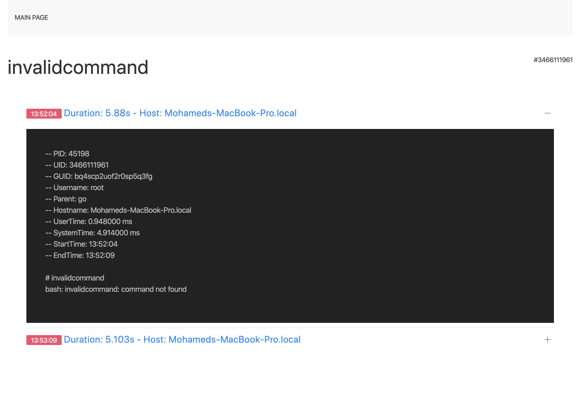

# gcron server [In Development]
A go written tool to manage distributed cron jobs with centralized GUI. This will help you monitor gcrons if you have multiple servers.

## ScreenShots
`localhost:1401`  
#### Main Page

#### Task Details


## Requirements 
 - [gcron client](https://github.com/mbrostami/gcron)


## TODO
- [ ] Clean code!
- [ ] Write tests
- [x] Implement shared lock for clients
- [x] Migrate mutex from file locking to use db
- [x] Mutex client timeout
- [x] Pick distributed high performance database to store all logs (search optimised, hash O(1) read support)
- [x] GUI
  - [x] Authentication
  - [x] Use FE framework (uikit, npm, webpack)
  - [ ] Search logs (tag, hostname, uid, command, guid, output)
  - [x] Bundle JS with webpack
  - [ ] Bundle CSS with webpack
- [ ] Log stream proxy... (remote third party log server, REST Api, tcp/udp)
- [ ] TLS enabled over RPC
- [ ] Client authentication + (caching system)
- [ ] Async write (Get stream logs and write in database async)
- [ ] Handle timeouts
- [ ] Customized taging clientside
- [ ] Support different agents
- [ ] Fix casts int32 to int or int64 to int32


## Development
`go run main.go --log.level=trace`
```
      --log.enable           Enable log in file (default false)
      --log.level string     Log level (default "info")
      --log.path string      Log file path (default "/var/log/gcron/gcron-server.log")
      --server.host string   Server host (default "localhost")
      --server.port string   Server port (default "1400")
```  

#### FrontEnd:   
```
cd web/pages/static/public
npm install
./node_modules/webpack/bin/webpack.js
```
